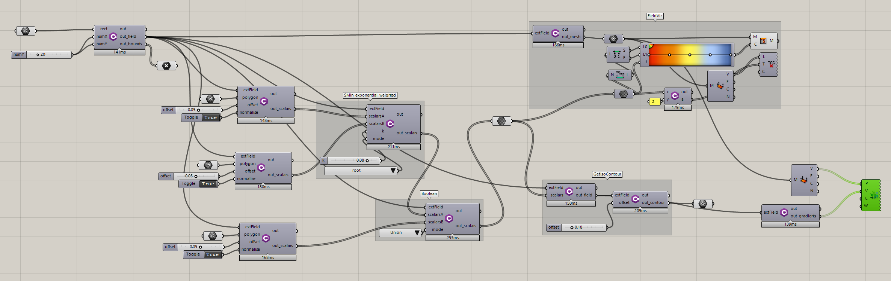
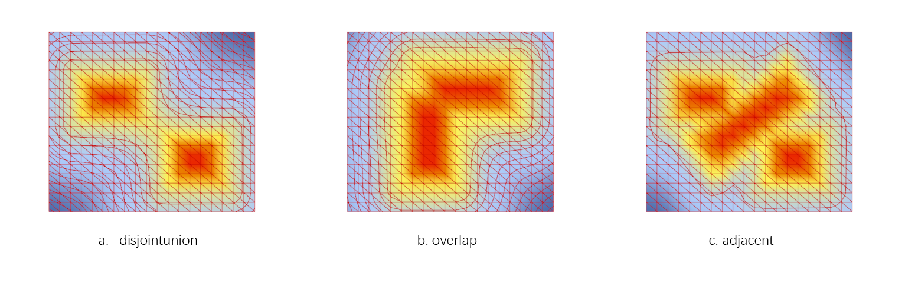
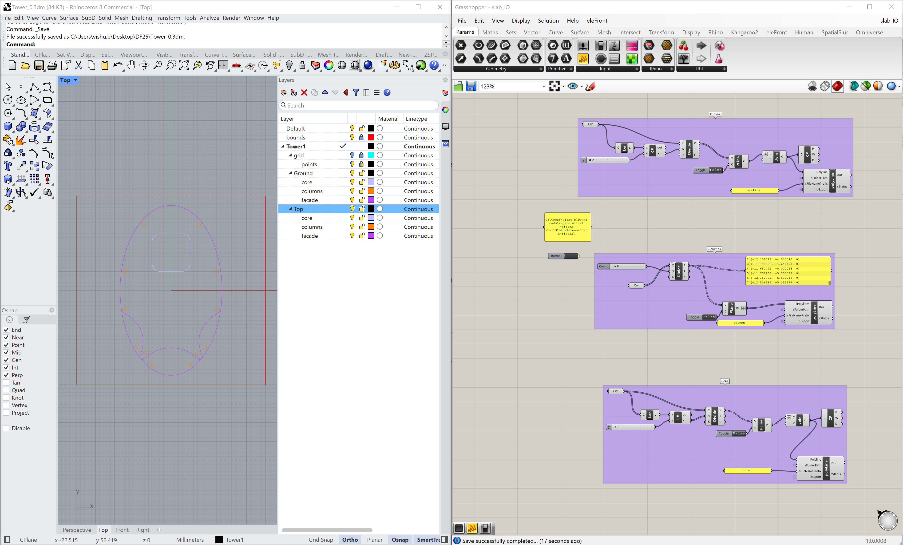

# Scalar_Field_GH

*Grasshopper definition for generating a 2D signed distance field (SDF) from Rhino polylines/meshes. Exports a **scalar field JSON** (`resolution`, `bounds_min/max`, `values`) and can be adapted to the DF25 SDF format for downstream ML (Alice2, LatentSDF).* 

**Definition:** `zExtMeshField.gh`  
**External libs (Windows/Rhino 8, from Alice2):** `freeglut.dll`, `zSpace.External.dll`, `zSpace_Core.dll`, `zSpace_External.dll`, `zSpace_Interface.dll`, `zSpace_InterOp.dll`, `zSpace_Toolsets.dll`

> **Note:** These binaries are provided with the **Alice2** distribution.

---

## Table of Contents
1.[Introduction](#introduction)
2.[Function Overview](#function-overview)
3.[Example](#example)
4.[Native JSON export (sample)](#native-json-export-sample)
5.[Troubleshooting](#troubleshooting)
6.[Citing](#citing)
7.[License](#license)
8.[Third-party dependencies](#third-party-dependencies)

---

## Introduction
`Scalar_Field_GH` computes a **signed distance field** on a regular XY grid from user‑picked **closed polylines** (and optional meshes) in Rhino 8. 

The **native export** is a compact JSON containing grid **resolution**, **bounds** in world units, and flattened **values**. If you need the fuller DF25 schema (with `grid`, `voxel_size`, `origin`, etc.), use a tiny adapter script that derives those fields from the native JSON (mapping shown below).

**Environment**
- Rhino **8** + Grasshopper (Windows x64)
- zSpace interop DLLs listed above (keep alongside the GH file or under `%APPDATA%/Grasshopper/Libraries/zSpace/`)
- If the GH definition uses Script components, add DLLs via **Manage Assemblies…** and **Unblock** each DLL in Windows file properties.

---

## Function Overview

**Inputs**
- **Curves:** one or more **closed polylines** in World XY
- **Mesh (optional):** used for bounds/acceleration

**Parameters (typical GH sliders/panels)**
- `resolution_x, resolution_y` (aka `nx, ny`) — grid resolution; use 128–1024 depending on scale
- `bbox_pad` — padding added to the input bounding box
- `origin` — world‑space lower‑left corner of the sampled grid (optional; else inferred from bounds)
- `units` — `m | mm | cm`
- `outDir` — output folder (default `./outputs/step1/`)


*Figure 1: Grasshopper component interface showing input parameters, curves, mesh inputs, and output settings for the scalar field generation.*

**Outputs**
- `data_field*.json` — scalar field (2D) with fields:
  - `resolution: [nx, ny]`
  - `bounds_min: [xmin, ymin, zmin]`
  - `bounds_max: [xmax, ymax, zmax]` *(for 2D, `zmin == zmax`)*
  - `values: [ ... ]` — length `nx*ny`, **x‑fastest** flattening: `index = y*nx + x`


*Figure 2: Generated output files including the main data_field.json file and optional format conversions.*

---

## Example

*Figure 3: Example visualization of the scalar field generation process showing input geometry and resulting distance field.*

### Native JSON export (sample)
```json
{
  "resolution": [128, 128],
  "bounds_min": [-75, -75, 0],
  "bounds_max": [75, 75, 0],
  "values": [6.39565, 6.30361, 6.21247, 6.12224, 6.03297, 5.94472, 5.85751, 5.7714, 5.68644, 5.60269, 5.52019, 5.439, 5.35919, 5.28082, 5.20394, 5.12863, "…"]
}
```json
{
  "resolution": [128, 128],
  "bounds_min": [-75, -75, 0],
  "bounds_max": [75, 75, 0],
  "values": [6.1915, 6.09709, 6.00352, 5.91083, 5.81873, 5.72663, 5.63454, 5.54308, 5.45265, 5.3633, 5.27465, 5.18601, 5.09743, 5.00977, 4.92338, 4.83825, 4.75344, 4.66862, 4.5844, 4.50171, 4.42058, 4.33998, 4.25938, 4.17949, 4.10144, 4.02515, 3.94919, 3.87329, 3.79888, 3.72673, 3.65586, 3.585, 3.51504, 3.44767, 3.38228, 3.31699, 3.25247, 3.19089, 3.13157, 3.07235, "…"]
}
```
*(Values truncated; full array length is `128 × 128 = 16384`.)*


---

## Troubleshooting
- **Missing assemblies** — Add references to `zSpace_*.dll` via *Manage Assemblies…* and ensure files are **Unblocked**.
- **BadImageFormatException** — 32/64‑bit mismatch. Use Rhino 8 x64 and matching DLLs.
- **Zero/flat field** — Ensure curves are **closed**, `resolution_x/y` > 0, and bounds aren’t degenerate.
- **Sign flipped** — If interior/exterior is inverted, switch the winding test in script or standardize `sign_convention`.
- **I/O permissions** — Export folder must be writable; try a path inside the repo.

---

## Citing
If you use the library of ZSPACE in a project, please refer to the GitHub repository.

```bibtex
@misc{zspace-framework,
  title  = {{zspace}: A simple C++ header-only collection of geometry data-structures, algorithms and city data visualization framework.},
  author = {Taizhong Chen},
  note   = {https://github.com/venumb/ZSPACE},
  year   = {2018}
}
```

## License
The library is licensed under the **MIT License**.

## Third-party dependencies
The library has some dependencies on third-party tools and services, which have different licensing as listed below. Thanks a lot!

- **OpenGL** for display methods. End users, independent software vendors, and others writing code based on the OpenGL API are free from licensing requirements.
- **stb** for text rendering. These single-file libraries are released into the **public domain** and can be used freely for any purpose.
- **GLEW** for managing OpenGL extensions. GLEW is open-source and distributed under the **Modified BSD** license, allowing free use in both open and closed source projects.
- **GLFW** for window and input management. GLFW is licensed under the **zlib/libpng** license, permitting free use in commercial and non-commercial applications.

